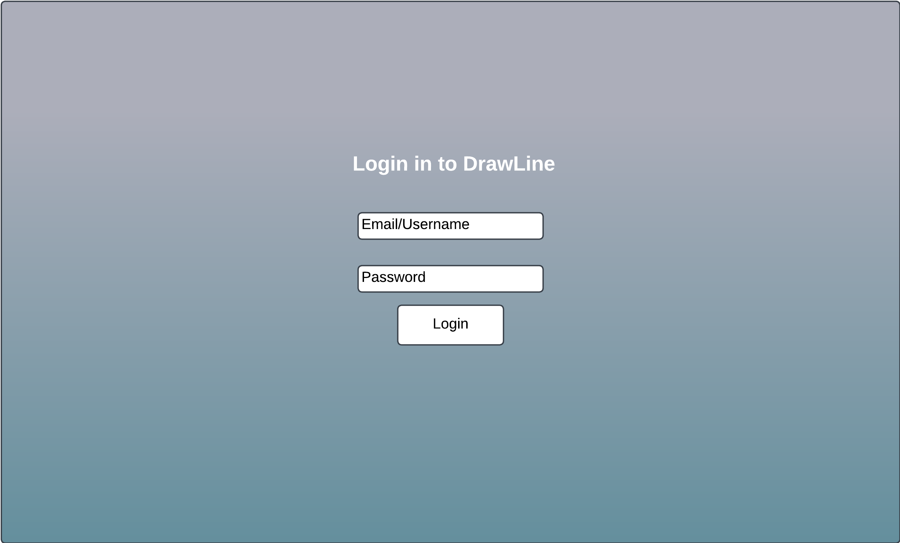

<!--# Medical Murder Mystery

## dataFiles Info
Below is important info about the files in dataFiles

### rooms.json
For this file, the positions of the doors array in each room is relative to the position of the room, making it easier to add with code.
-->
# Medical Murder Mystery

[My Notes](./notes.md)

Medical Murdery Mystery is a game where players act as characters working in a hospital. Each player will be able to navigate around the simple map, entering rooms one by one. As they do, they will be able to suspect their fellow players of murder by various means in multiple possible locations. It's based off of the popular board game Clue, but with a medical spin on it. Players will also be able to go back and see accusations they have made.

## 🚀 Specification Deliverable

For this deliverable I did the following. I checked the box `[x]` and added a description for things I completed.

- [x] Proper use of Markdown
- [x] A concise and compelling elevator pitch
- [x] Description of key features
- [x] Description of how you will use each technology
- [x] One or more rough sketches of your application. Images must be embedded in this file using Markdown image references.

### Elevator pitch

Want to be the best investigator in town? Good at sniffing out yoru suspicious friends? Then Medical Murdery Mystery is the game for you! Take on the role of a medical worker in Provo City Hospital where a mysterious murder has taken place. The Provo police have tasked you and your coworkers with finding the culprit, but you suspect it was one of them, or perhaps even yourself. Come play and find out!

### Design

These two images are mockups of the site and board. There is a simple login page, and there is the playing page, which will include the board. I will probably make the board more visually interesting as well. The playing page will include some player information and display the current suspicions being voiced by other players.

### Key features

- Users can securely sign in
- Several users can join together in a game
- On their turn, players will roll dice, move spaces, enter rooms, and submit suspicions
- The board will update with player movements on every device
- Players' suspicion submissions will be stored and viewable on a separate page after the game
- Player turns will rotate around active players
- Players will gather info automatically when they make a guess
- When a player submits a correct guess, they win

### Technologies

I am going to use the required technologies in the following ways.

- **HTML** - It uses HTML to define the structure of the webpages. There will be three pages:
    1. The login page.
    2. The playing page with the game board.
    3. The history page to see past suspicions and accusations.
- **CSS** - CSS will be used to make the the app look appealing, as well as make it fit on multiple screen sizes.
- **JavaScript** - JavaScript will define the main functionality of moving on the board and submitting suspicions.
- **React** - React will be responsible for tying together the HTML, CSS, and JS. It will also handle the routing.
- **Service** - There will be multiple service endpoints:
    * Backend service for logging in
    * Sending board moves and suspicions to the backend
    * Retrieving history of suspicions to display
    * Also retrieving a random Book of Mormon verse to display in the footer from [BraydenTW/book-of-mormon-api](https://book-of-mormon-api.vercel.app) ([GitHub](https://github.com/BraydenTW/book-of-mormon-api))
- **DB/Login** - The database will store players' credentials and allow them to log in, which is required to play. The database will also store the history of suspicions the player has made.
- **WebSocket** - WebSocket will broadcast the current board and player suspicions in real-time to other players.

## 🚀 AWS deliverable

For this deliverable I did the following. I checked the box `[x]` and added a description for things I completed.

- [x] **Server deployed and accessible with custom domain name** - [My server link](https://mmmystery.click/).

## 🚀 HTML deliverable

For this deliverable I did the following. I checked the box `[x]` and added a description for things I completed.

- [x] **HTML pages** - The 3 HTML pages are filled and linked together.
- [x] **Proper HTML element usage** - Each page contains MAIN, NAV, HEADER, BODY, FOOTER
- [x] **Links** - Each page contains navigation links in the header.
- [x] **Text** - Pages have placeholder text that represents what it will be like.
- [x] **3rd party API placeholder** - There is a button that will eventually call a dice roller API. The footer also shows a placeholder for a random Book of Mormon verse.
- [x] **Images** - There is a favicon, and it is also used in the header of each page.
- [x] **Login placeholder** - The login is represented on the index.html page.
- [x] **DB data placeholder** - The history page shows history data that will be stored in the database.
- [x] **WebSocket placeholder** - The game board and players will update in realtime.

## 🚀 CSS deliverable

For this deliverable I did the following. I checked the box `[x]` and added a description for things I completed.

- [x] **Header, footer, and main content body** - I used CSS to make a simple but appealing design for these elements.
- [x] **Navigation elements** - I made my navbar work with CSS well, it's simple but effective.
- [x] **Responsive to window resizing** - The site works well with different screen sizes.
- [x] **Application elements** - I used flex and grid all over the place to make the site work. I also used some modals to make functionality possible on mobile.
- [x] **Application text content** - I found a nice Google font that makes the text look good.
- [x] **Application images** - I sized my logo image and used it as a link to the home page. It's also the favicon.

## 🚀 React part 1: Routing deliverable

For this deliverable I did the following. I checked the box `[x]` and added a description for things I completed.

- [x] **Bundled using Vite** - Everything is bundled, transpiled, and built with Vite.
- [x] **Components** - All my HTML has been turned into components and is rendering properly. Each page is it's own component, plus several part of each page are separated out as well.
- [x] **Router** - Routes are set up and working properly.

## 🚀 React part 2: Reactivity

For this deliverable I did the following. I checked the box `[x]` and added a description for things I completed.

- [x] **All functionality implemented or mocked out** - Everything is working as intended.
    * Players login and username is saved to `localStorage`
    * Players join a lobby and start game. `setInterval`s were used to make it seem other players are joining and creating games.
    * Player can roll dice, move around the board, and make guesses. Other players are simply mocked with `setTimeout` called recursively.
    * Chat displays important information about what is happening in the game.
    * First player to guess the correct combination wins.
    * Players can see past guesses on the History page, which is stored in `localStorage`
- [x] **Hooks** - I've implemented `useState`, `useEffect`, and even `useRef` all over the place.

## 🚀 Service deliverable

For this deliverable I did the following. I checked the box `[x]` and added a description for things I completed.

- [x] **Node.js/Express HTTP service** - Done, express is implemented.
- [x] **Static middleware for frontend** - Done, page loads on server.
- [x] **Calls to third party endpoints** - Calls for a Book of Mormon quote in the footer. This is in the footer Component function in App.jsx.
- [x] **Backend service endpoints** - There are lots of these. You can test all of them if you open up multiple browsers and create multiple accounts, then join a lobby together. You can play whole games this way, which should use all.
    * Also, you can check the history page and then return to the play page without the game disappearing.
- [x] **Frontend calls service endpoints** - The frontend uses `fetch` to pull from the server a lot.
- [x] **Supports registration, login, logout, and restricted endpoint** - Users can create accounts, log in, and log out. In-site endpoints only work for authenticated users.

Note: There are differences between my game and the normal game of Clue. Players don't pass data around here, they just discover it on their own as they guess. Also, players can only exit the same door they entered into a room. 

## 🚀 DB/Login deliverable

For this deliverable I did the following. I checked the box `[x]` and added a description for things I completed.

- [x] **Stores data in MongoDB** - Stores a history of guesses that the user makes in MongoDB. This history is displayed on the history page.
- [x] **Stores credentials in MongoDB** - Users are created and credentials are stored in MongoDB.

There weren't a ton of commits that I made for this deliverable, but honestly there weren't that many changes to make.

## 🚀 WebSocket deliverable

For this deliverable I did the following. I checked the box `[x]` and added a description for things I completed.

- [ ] **Backend listens for WebSocket connection** - I did not complete this part of the deliverable.
- [ ] **Frontend makes WebSocket connection** - I did not complete this part of the deliverable.
- [ ] **Data sent over WebSocket connection** - I did not complete this part of the deliverable.
- [ ] **WebSocket data displayed** - I did not complete this part of the deliverable.
- [ ] **Application is fully functional** - I did not complete this part of the deliverable.
