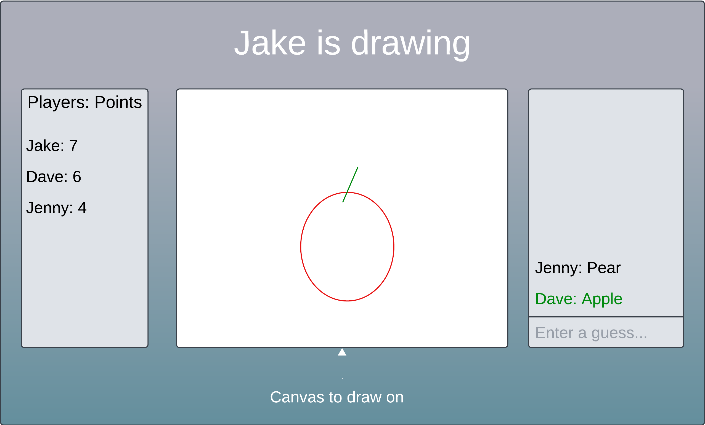

# DrawnLine

[My Notes](notes.md)

DrawnLine is an app that allows users to play receive a random word, and then draw it. That image will be transmitted to other players, and those players will have to guess what it is. Think of it like online charades, but drawing! Players will earn points by guessing correctly, and the person that gets the most correct in a session wins. The number of wins will be stored per player and displayed in a leaderboard to see who the best guesser is overall.

## 🚀 Specification Deliverable

For this deliverable I did the following. I checked the box `[x]` and added a description for things I completed.

- [x] Proper use of Markdown
- [x] A concise and compelling elevator pitch
- [x] Description of key features
- [x] Description of how you will use each technology
- [x] One or more rough sketches of your application. Images must be embedded in this file using Markdown image references.

### Elevator pitch

Do you want to show off your amazing drawing skills to your friends? Want to cure some boredom? DrawnLine solves both of these problems!  Using DrawnLine, you can easily get together with your friends virtually to play a drawing game together. Just get on the website, connect, and then start drawing away! Each person will have turns drawing and guessing the given word. Your friends will know how good you are at drawing, and it'll keep you wanting to come back for more!

### Design




These two images are mockups of the site and how it might look. There is a simple login page, and there is the playing page. The playing page has a panel to display the users and their points, a canvas for the drawer to draw on and the guessers to view, and a panel for the guessers to guess in. Dave correctly guessed the drawing was an apple.

<!--```mermaid
sequenceDiagram
    actor You
    actor Website
    You->>Website: Replace this with your design
```-->

### Key features

- Users can securely sign in
- Several users can join together in a game
- On their turn, drawer will receive a random prompt to draw
- Other players will guess what it is as the first player draws
- Each player guess is shown as they are made
- Player with the most correct guesses wins
- Players can view the leaderboard of most wins overall

### Technologies

I am going to use the required technologies in the following ways.

- **HTML** - It uses HTML to define the structure of the webpages. There will be three pages:
    1. The login page.
    2. The drawing canvas/the input box for guessing.
    3. The leaderboard page to show who has the most wins.
- **CSS** - CSS will be used to make the the app look appealing, as well as make it fit on multiple screen sizes.
- **React** - React will make the main functionality of drawing on the canvas and making guesses possible. It will also be used for logging in to the site and page routing.
- **Service** - There will be multiple service endpoints:
    * Backend service for logging in
    * Submitting guesses and saving correct answers
    * Retrieving the leaderboard to display win counts
    * Using an API like [WordsAPI](https://www.wordsapi.com/docs/) to retrieve a random prompt word to draw
- **DB/Login** - The database will store players' credentials and allow them to log in, which is required to play. The database will also store the number of wins for each user to be ranked on the leaderboard.
- **WebSocket** - WebSocket will broadcast the current canvas and player guesses and alert when someone has guessed correctly.

## 🚀 AWS deliverable

For this deliverable I did the following. I checked the box `[x]` and added a description for things I completed.

- [ ] **Server deployed and accessible with custom domain name** - [My server link](https://yourdomainnamehere.click).

## 🚀 HTML deliverable

For this deliverable I did the following. I checked the box `[x]` and added a description for things I completed.

- [ ] **HTML pages** - I did not complete this part of the deliverable.
- [ ] **Proper HTML element usage** - I did not complete this part of the deliverable.
- [ ] **Links** - I did not complete this part of the deliverable.
- [ ] **Text** - I did not complete this part of the deliverable.
- [ ] **3rd party API placeholder** - I did not complete this part of the deliverable.
- [ ] **Images** - I did not complete this part of the deliverable.
- [ ] **Login placeholder** - I did not complete this part of the deliverable.
- [ ] **DB data placeholder** - I did not complete this part of the deliverable.
- [ ] **WebSocket placeholder** - I did not complete this part of the deliverable.

## 🚀 CSS deliverable

For this deliverable I did the following. I checked the box `[x]` and added a description for things I completed.

- [ ] **Header, footer, and main content body** - I did not complete this part of the deliverable.
- [ ] **Navigation elements** - I did not complete this part of the deliverable.
- [ ] **Responsive to window resizing** - I did not complete this part of the deliverable.
- [ ] **Application elements** - I did not complete this part of the deliverable.
- [ ] **Application text content** - I did not complete this part of the deliverable.
- [ ] **Application images** - I did not complete this part of the deliverable.

## 🚀 React part 1: Routing deliverable

For this deliverable I did the following. I checked the box `[x]` and added a description for things I completed.

- [ ] **Bundled using Vite** - I did not complete this part of the deliverable.
- [ ] **Components** - I did not complete this part of the deliverable.
- [ ] **Router** - Routing between login and voting components.

## 🚀 React part 2: Reactivity

For this deliverable I did the following. I checked the box `[x]` and added a description for things I completed.

- [ ] **All functionality implemented or mocked out** - I did not complete this part of the deliverable.
- [ ] **Hooks** - I did not complete this part of the deliverable.

## 🚀 Service deliverable

For this deliverable I did the following. I checked the box `[x]` and added a description for things I completed.

- [ ] **Node.js/Express HTTP service** - I did not complete this part of the deliverable.
- [ ] **Static middleware for frontend** - I did not complete this part of the deliverable.
- [ ] **Calls to third party endpoints** - I did not complete this part of the deliverable.
- [ ] **Backend service endpoints** - I did not complete this part of the deliverable.
- [ ] **Frontend calls service endpoints** - I did not complete this part of the deliverable.

## 🚀 DB/Login deliverable

For this deliverable I did the following. I checked the box `[x]` and added a description for things I completed.

- [ ] **User registration** - I did not complete this part of the deliverable.
- [ ] **User login and logout** - I did not complete this part of the deliverable.
- [ ] **Stores data in MongoDB** - I did not complete this part of the deliverable.
- [ ] **Stores credentials in MongoDB** - I did not complete this part of the deliverable.
- [ ] **Restricts functionality based on authentication** - I did not complete this part of the deliverable.

## 🚀 WebSocket deliverable

For this deliverable I did the following. I checked the box `[x]` and added a description for things I completed.

- [ ] **Backend listens for WebSocket connection** - I did not complete this part of the deliverable.
- [ ] **Frontend makes WebSocket connection** - I did not complete this part of the deliverable.
- [ ] **Data sent over WebSocket connection** - I did not complete this part of the deliverable.
- [ ] **WebSocket data displayed** - I did not complete this part of the deliverable.
- [ ] **Application is fully functional** - I did not complete this part of the deliverable.
