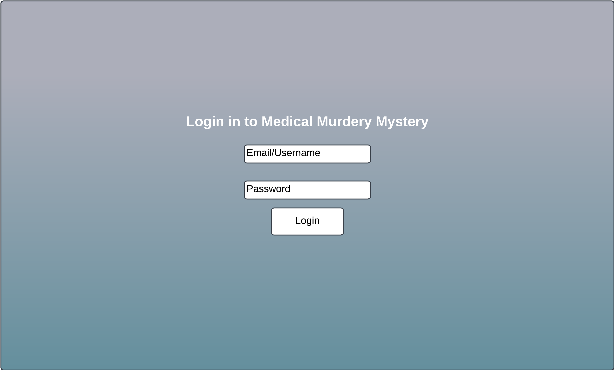
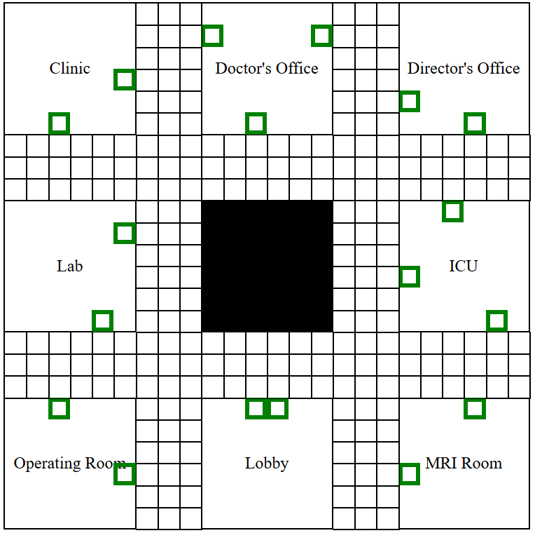

# (Medical Murder Mystery) Online Clue Clone
This was a secondary idea I had for my startup that I'm going to work on simultaneously. I'm not sure I want to use it, but to make sure it demonstrates the proper commits if I do use it, I'm going to keep it here in the startup repo.


## dataFiles Info
Below is important info about the files in dataFiles

### rooms.json
For this file, the positions of the doors array in each room is relative to the position of the room, making it easier to add with code.

# Medical Murder Mystery

[My Notes](../notes.md)

Medical Murdery Mystery is a game where players act as characters working in a hospital. Each player will be able to navigate around the simple map, entering rooms one by one. As they do, they will be able to suspect their fellow players of murder by various means in multiple possible locations. It's based off of the popular board game Clue, but with a medical spin on it.

## 🚀 Specification Deliverable

For this deliverable I did the following. I checked the box `[x]` and added a description for things I completed.

- [x] Proper use of Markdown
- [x] A concise and compelling elevator pitch
- [x] Description of key features
- [x] Description of how you will use each technology
- [x] One or more rough sketches of your application. Images must be embedded in this file using Markdown image references.

### Elevator pitch

Want to be the best investigator in town? Good at sniffing out yoru suspicious friends? Then Medical Murdery Mystery is the game for you! Take on the role of a medical worker in Provo City Hospital where a mysterious murder has taken place. The Provo police have tasked you and your coworkers with finding the culprit, but you suspect it was one of them, or perhaps even yourself. Come play and find out!

### Design




These two images are mockups of the site and board. There is a simple login page, and there is the playing page, which will include the board. I will probably make the board more visually interesting as well. The playing page will include some player information and display the current suspicions being voiced by other players.

<!--```mermaid
sequenceDiagram
    actor You
    actor Website
    You->>Website: Replace this with your design
```-->

### Key features

- Users can securely sign in
- Several users can join together in a game
- On their turn, drawer will receive a random prompt to draw
- Drawing will appear on all devices, but only the drawer can draw on it
- Other players will guess what it is as the first player draws
- Each player guess is shown as they are made
- The player chosen to draw will change over multiple rounds
- Player with the most correct guesses wins
- Players can view the leaderboard of most wins overall

### Technologies

I am going to use the required technologies in the following ways.

- **HTML** - It uses HTML to define the structure of the webpages. There will be three pages:
    1. The login page.
    2. The drawing canvas/the input box for guessing.
    3. The leaderboard page to show who has the most wins.
- **CSS** - CSS will be used to make the the app look appealing, as well as make it fit on multiple screen sizes.
- **React** - React will make the main functionality of drawing on the canvas and making guesses possible. It will also be used for logging in to the site and page routing.
- **Service** - There will be multiple service endpoints:
    * Backend service for logging in
    * Submitting guesses and saving correct answers
    * Retrieving the leaderboard to display win counts
    * Using an API like [WordsAPI](https://www.wordsapi.com/docs/) to retrieve a random prompt word to draw
- **DB/Login** - The database will store players' credentials and allow them to log in, which is required to play. The database will also store the number of wins for each user to be ranked on the leaderboard.
- **WebSocket** - WebSocket will broadcast the current canvas and player guesses and alert when someone has guessed correctly.

## 🚀 AWS deliverable

For this deliverable I did the following. I checked the box `[x]` and added a description for things I completed.

- [ ] **Server deployed and accessible with custom domain name** - [My server link](https://yourdomainnamehere.click).

## 🚀 HTML deliverable

For this deliverable I did the following. I checked the box `[x]` and added a description for things I completed.

- [ ] **HTML pages** - I did not complete this part of the deliverable.
- [ ] **Proper HTML element usage** - I did not complete this part of the deliverable.
- [ ] **Links** - I did not complete this part of the deliverable.
- [ ] **Text** - I did not complete this part of the deliverable.
- [ ] **3rd party API placeholder** - I did not complete this part of the deliverable.
- [ ] **Images** - I did not complete this part of the deliverable.
- [ ] **Login placeholder** - I did not complete this part of the deliverable.
- [ ] **DB data placeholder** - I did not complete this part of the deliverable.
- [ ] **WebSocket placeholder** - I did not complete this part of the deliverable.

## 🚀 CSS deliverable

For this deliverable I did the following. I checked the box `[x]` and added a description for things I completed.

- [ ] **Header, footer, and main content body** - I did not complete this part of the deliverable.
- [ ] **Navigation elements** - I did not complete this part of the deliverable.
- [ ] **Responsive to window resizing** - I did not complete this part of the deliverable.
- [ ] **Application elements** - I did not complete this part of the deliverable.
- [ ] **Application text content** - I did not complete this part of the deliverable.
- [ ] **Application images** - I did not complete this part of the deliverable.

## 🚀 React part 1: Routing deliverable

For this deliverable I did the following. I checked the box `[x]` and added a description for things I completed.

- [ ] **Bundled using Vite** - I did not complete this part of the deliverable.
- [ ] **Components** - I did not complete this part of the deliverable.
- [ ] **Router** - Routing between login and voting components.

## 🚀 React part 2: Reactivity

For this deliverable I did the following. I checked the box `[x]` and added a description for things I completed.

- [ ] **All functionality implemented or mocked out** - I did not complete this part of the deliverable.
- [ ] **Hooks** - I did not complete this part of the deliverable.

## 🚀 Service deliverable

For this deliverable I did the following. I checked the box `[x]` and added a description for things I completed.

- [ ] **Node.js/Express HTTP service** - I did not complete this part of the deliverable.
- [ ] **Static middleware for frontend** - I did not complete this part of the deliverable.
- [ ] **Calls to third party endpoints** - I did not complete this part of the deliverable.
- [ ] **Backend service endpoints** - I did not complete this part of the deliverable.
- [ ] **Frontend calls service endpoints** - I did not complete this part of the deliverable.

## 🚀 DB/Login deliverable

For this deliverable I did the following. I checked the box `[x]` and added a description for things I completed.

- [ ] **User registration** - I did not complete this part of the deliverable.
- [ ] **User login and logout** - I did not complete this part of the deliverable.
- [ ] **Stores data in MongoDB** - I did not complete this part of the deliverable.
- [ ] **Stores credentials in MongoDB** - I did not complete this part of the deliverable.
- [ ] **Restricts functionality based on authentication** - I did not complete this part of the deliverable.

## 🚀 WebSocket deliverable

For this deliverable I did the following. I checked the box `[x]` and added a description for things I completed.

- [ ] **Backend listens for WebSocket connection** - I did not complete this part of the deliverable.
- [ ] **Frontend makes WebSocket connection** - I did not complete this part of the deliverable.
- [ ] **Data sent over WebSocket connection** - I did not complete this part of the deliverable.
- [ ] **WebSocket data displayed** - I did not complete this part of the deliverable.
- [ ] **Application is fully functional** - I did not complete this part of the deliverable.
